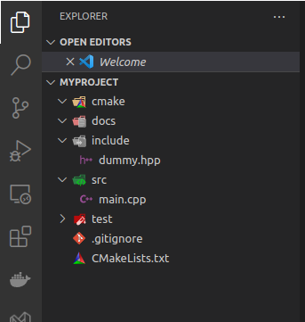

# cargo newcpp

This tool extends [Cargo](http://doc.crates.io/) to allow for the creation of new C++ projects in the spirit of `cargo new <project>`

```console,ignore
cargo install cargo-newcpp
```

Ensure that you have a fairly recent version of rust/cargo installed. On Ubuntu you might also want to install `cmake` and `gcc` or `g++` so that you can actually build project.

## Recommended prereqs 
If you'd like to kick the tires on the build feature (cargo buildcpp) you will want the following installed
```console,ignore
sudo apt install gcc, g++, ninja-build, build-essential, cmake
```


## Create a new project

Create a new CPP project with the following command.   
```console,ignore
cargo newcpp <your_project_name> [--lib]
```

This will output to the following default project scaffolding.



## Building the CPP project with cargo
Once you've create the project, you can use the following example to build the project.
```console,ignore
cd <your_project_name> 
cargo buildcpp [--debug | --release]
```

By default, ```buildcpp``` will place cmake buildtree artifacts into the **target/debug** folder.  Specifying the **--release** flag will generate the buildtree artifacts in **target/release**


## Cleaning the CPP project with cargo-cleancpp
This is functionally equivilant to "rm -rf target/".  I struggled with whether or not I should do something more idiomatic to modern cmake (e.g. ```cmake --build <target> -t clean``` or ```cmake --fresh ...```) but these did not feel right and chose to default to what ```cargo clean`` does instead.

```console,ignore
cargo cleancpp 
```

